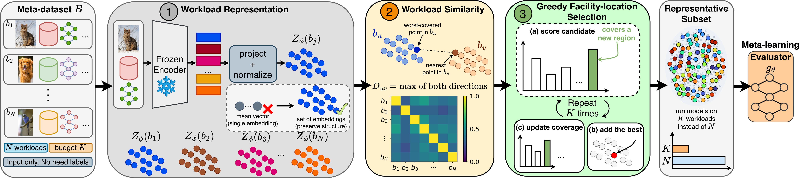

# ActiveEvaluator

This is the code for **"You Don't Need the Whole Meta-Dataset: Budgeted Model Evaluation on Unseen and Unlabeled Data"**. ActiveEvaluator selects a small representative subset `A ⊆ B` of the meta-dataset before any reference model is run, then trains the MetaEvaluator architecture on `A` instead of the full `B`. Only the selected workloads need model runs and accuracy labels, which cuts the supervision cost from `R·|B|` to `R·|A|` model–workload runs.



## What is included

- **Workload representation (Eq. 2–3).** Every input goes through a frozen contextual encoder. Each token is projected with a fixed `W` and L2-normalized, and a workload is the union of its inputs' token sets. The encoders are MiniLM for Text2SQL, DINOv2-small for images, and parameter-free feature propagation `[X, ÂX, ²X]` for graph nodes.
- **Workload similarity (Eq. 4–5).** Pairs are compared with the symmetric Hausdorff distance and `S_uv = exp(-D_uv²/τ)`, where `τ` is the median of `D_uv²` over `u < v`.
- **Selection (Alg. 1).** Greedy facility location under a budget `K`, with lazy evaluation that returns the same greedy sequence. Greedy prefixes give every smaller budget from a single pass.
- **Assignment weights (App. A–B).** Each workload is assigned to its nearest representative. The multiplicity `γ_u` of each representative weights its loss during meta-training and context adaptation.
- **MetaEvaluator** with context-vector adaptation (5 steps per unseen model), trained in bfloat16 mixed precision on CUDA.
- **Ablations (Tab. 2).**
  - Meta-learning algorithms, each with its own adaptation-step count: MAML (12), FO-MAML (10), Reptile (9), Meta-SGD (9), ANIL (8), ProtoNet (0).
  - Workload distances: Sliced Wasserstein, Fréchet, Chamfer, Mahalanobis, Euclidean.
- **Label-free baselines:** ATC, DoC, GDE, ALine-D and Majority.
- **EX-S** for Text2SQL: a prediction is correct only if it agrees with the reference on the original database and on its five controlled variants.
- **Model pools:** 35 Text2SQL, 20 image-classification and 16 node-classification models. Each node architecture is trained with three seeds.
- **Evaluation protocol:** repeated runs over sampled pools of 5–30 unseen models. Metrics are MAE with 95% CIs, correct pairs, Kendall's τ, Top-1/Top-5 and end-to-end latency.
- **One shell entry point** for tests, selection, model runs, the main results and every ablation.

## 1. Create the environment

Python 3.10 or newer is required.

```bash
git clone <repository-url>
cd active_model_eval

python -m venv .venv
source .venv/bin/activate
python -m pip install --upgrade pip
python -m pip install -r requirements.txt

# GOOD-Cora / GOOD-Twitch / GOOD-WebKB
python -m pip install git+https://github.com/divelab/GOOD.git
```

`torch_geometric` may need a CUDA-specific wheel. If the default install doesn't match your PyTorch/CUDA build, follow the [PyG installation matrix](https://pytorch-geometric.readthedocs.io/en/latest/install/installation.html).

## 2. Configure the datasets

Each modality reads its paths from `configs/<task>.json`. All data lives under `data/`, which Git ignores except for the two Spider files already in the repository.

### Text2SQL datasets

Every benchmark is one JSON list of examples in the format of `data/sft_spider_dev_text2sql.json`. Each example has `db_id`, `db_path`, `question`, `evidence`, `sql` and `schema` (`schema_items` with `table_name`, `column_names`, `column_types`, plus `foreign_keys`). The file paths are set under `meta_pool`, `sources` and `targets` in `configs/text2sql.json`.

| Dataset | Official source | Save to | Role |
|---|---|---|---|
| Spider | [project page](https://yale-lily.github.io/spider) | `data/sft_spider_{train,dev}_text2sql.json` | meta-dataset pool, model source, target |
| BIRD | [project page](https://bird-bench.github.io/) | `data/sft_bird_{train,dev}_text2sql.json` | meta-dataset pool, model source, target |
| Spider 2.0 | [repository](https://github.com/xlang-ai/Spider2) | `data/sft_spider2_lite_text2sql.json` | target |
| BEAVER | [repository](https://github.com/beaverbench/beaver) | `data/sft_beaver_text2sql.json` | target |
| ScienceBenchmark | [dataset page](https://sciencebenchmark.cloudlab.zhaw.ch/) | `data/sft_sciencebenchmark_text2sql.json` | target |
| EntSQL | [dataset](https://huggingface.co/datasets/XuWave/Rethinking_Enterprise_Text_to_SQL) | `data/sft_entsql_text2sql.json` | target |
| LiveSQLBench | [repository](https://github.com/bird-bench/livesqlbench) | `data/sft_livesqlbench_text2sql.json` | target |

Databases are opened read-only from each example's `db_path`. You can also set `db_root` so that `<db_root>/<db_id>/<db_id>.sqlite` is used instead. Only targets whose file exists are evaluated.

### Image-classification datasets

MNIST, CIFAR-10 and ImageNet are the sources. The meta-dataset is built from their held-out images under random rotation, color, blur, noise and grayscale shifts.

| Role | Dataset | Official source | Save or extract to |
|---|---|---|---|
| Source | MNIST | [dataset page](https://yann.lecun.org/exdb/mnist/) | downloaded into `data/image/` |
| Source | CIFAR-10 | [dataset page](https://www.cs.toronto.edu/~kriz/cifar.html) | downloaded into `data/image/` |
| Source | ImageNet-1K | [download page](https://www.image-net.org/download.php) | `data/image/imagenet/val/<wnid>/*.JPEG` |
| Target | USPS | [torchvision](https://docs.pytorch.org/vision/stable/generated/torchvision.datasets.USPS.html) | downloaded into `data/image/` |
| Target | SVHN | [dataset page](http://ufldl.stanford.edu/housenumbers/) | downloaded into `data/image/` |
| Target | CIFAR-10.1 | [repository](https://github.com/modestyachts/CIFAR-10.1) | `data/image/cifar10.1/cifar10.1_v6_{data,labels}.npy` |
| Target | CIFAR-10-C | [Zenodo record](https://zenodo.org/records/2535967) | `data/image/CIFAR-10-C/{labels,<corruption>}.npy` |
| Target | ImageNet-V2 | [repository](https://github.com/modestyachts/ImageNetV2) | `data/image/imagenetv2-matched-frequency-format-val/<0–999>/` |
| Target | ImageNet-R | [repository](https://github.com/hendrycks/imagenet-r) | `data/image/imagenet-r/<wnid>/` |
| Target | ImageNet-Sketch | [repository](https://github.com/HaohanWang/ImageNet-Sketch) | `data/image/sketch/<wnid>/` |

ImageNet targets use each classifier's native ImageNet-1K head, and ImageNet-R predictions are restricted to its 200 classes. For digits and CIFAR, every model gets a linear head trained on frozen source features. CLIP and SigLIP classify zero-shot from class-name prompts.

### Node-classification datasets

| Dataset | Official source | Save to | Notes |
|---|---|---|---|
| ACMv9, Citationv1, DBLPv7 | [GNNEvaluator repository](https://github.com/Amanda-Zheng/GNNEvaluator) | `data/graph/{acm,network,dblp}/raw/<name>_{docs,edgelist,labels}.txt` | Target ACMv9 trains on DBLPv7, Citationv1 on ACMv9, and DBLPv7 on Citationv1 (`targets` in `configs/node.json`). |
| ogbn-arxiv | [OGB](https://ogb.stanford.edu/docs/nodeprop/#ogbn-arxiv) | downloaded into `data/graph/` | The source is the train-split subgraph; the target is the test nodes. |
| GOOD-Cora, GOOD-Twitch, GOOD-WebKB | [GOOD](https://github.com/divelab/GOOD) | downloaded into `data/graph/` | The source is the in-distribution train/validation/test nodes; the target is the OOD test nodes of the covariate shift. |

Source graphs use a 70/10/20 train/validation/held-out split. The meta-dataset consists of GNNEvaluator-style graphs built from the held-out labeled nodes with subgraph sampling, edge dropping, feature masking and feature noise.

## 3. Model pools

The pools follow the appendix tables:

- `configs/text2sql.json`: 35 Hugging Face checkpoints, each with the source dataset it was trained on.
- `configs/image.json`: 20 timm, Hugging Face and zero-shot models.
- `configs/node.json`: 16 PyG architectures.

Checkpoints download lazily on first use, and gated repositories need a token:

```bash
export HF_TOKEN=hf_...
```

Text2SQL models load in bfloat16 with `device_map="auto"`, so the 70B/72B checkpoints are sharded across the available GPUs. To load a model on a single device, set `"device_map": null` for its entry. Interrupted runs resume where they stopped. Text2SQL outputs are cached per example under `outputs/text2sql/cache/`. Trained image heads and GNN weights are cached, and every model's record only adds the workloads it is still missing.

## 4. EX-S database instances

EX-S compares predicted and reference results on the original database and on its five controlled variants. Put the variants of every target database at:

```text
data/database_variants/<db_id>/instance_1.sqlite
...
data/database_variants/<db_id>/instance_5.sqlite
```

A prediction counts as correct only when its canonical result matches the reference on all six instances. The result is order-sensitive only when the reference query has `ORDER BY`.

## 5. Run ActiveEvaluator

Each modality runs the same three commands. Replace `text2sql` with `image` or `node`.

```bash
# Representative selection (Alg. 1). Greedy prefixes give every budget from one pass.
python -m text2sql.run select --config configs/text2sql.json --budgets 1000 3000 6000 9000 15000 20000 25000

# Run every model on the selected workloads, on the full meta-dataset (for MetaEvaluator) and on the targets.
python -m text2sql.run records --config configs/text2sql.json
python -m text2sql.run records --config configs/text2sql.json --full

# 10 runs, each with a freshly sampled pool of unseen models; the rest are reference models.
python -m text2sql.run experiment --config configs/text2sql.json --budgets 9000 --full --baselines --pool-sizes 10 --runs 10
```

The paper budgets are `K = 9000` (Text2SQL), `8000` (image) and `10000` (node), each out of 30K workloads.

| Paper | Command |
|---|---|
| Tab. 1, Fig. 4 | `experiment --budgets 9000 --full --baselines --pool-sizes 10` |
| Fig. 5 (ranking vs. pool size) | `experiment --budgets 9000 --full --baselines --pool-sizes 5 10 15 20 25 30` |
| Fig. 6a (latency) | `fit_seconds`, `supervision_seconds` and `unseen_seconds` in the results file |
| Fig. 6b (MAE vs. K) | `experiment --budgets 1000 3000 6000 9000 15000 20000 25000 --full` |
| Tab. 2 left | `experiment --budgets 9000 --full --algorithms cavia maml fomaml reptile metasgd anil protonet` |
| Tab. 2 right | `select --metric <distance>` for each distance, then `experiment --budgets 9000 --selection outputs/text2sql/selection_*.npz` |
| App. E, F | the same commands with `image.run` and `node.run` |

Everything is written to the `out` directory of the config:

- **Selection:** `selection_<distance>.npz` holds the greedy order, marginal gains, `τ` and the `γ` weights per budget. The matching `.json` holds the embedding, distance and greedy runtimes.
- **Records:** `records/<model>.npz` holds the shift descriptors and accuracies per workload and target, plus the outputs the baselines need.
- **Results:** every results file has, for each setting, the mean and 95% CI of MAE, correct pairs, Kendall's τ, Top-1 and Top-5 per target and on average. It also stores the per-run predictions and timings.

Run `r` samples its unseen pool and seeds the evaluator with `seed + r`, so every method is compared on the same pools.

## 6. Run everything from one script

The default is a smoke run. It runs the unit tests, then, for every task, a reduced configuration: 200 workloads, `K = 60`, the first six models, two runs and every ablation.

```bash
bash scripts/run_all.sh
```

The paper-scale run covers every task, table, figure and ablation:

```bash
MODE=full DEVICE=cuda bash scripts/run_all.sh
```

Useful controls:

```bash
TASKS="text2sql image node"   # tasks to run
RUNS=10                       # repeated runs with 95% CIs
POOL_SIZE=10                  # unseen-model pool of Tab. 1
POOL_SIZES="5 10 15 20 25 30" # pool sizes of Fig. 5
SWEEP="1000 3000 6000 9000 15000 20000 25000"  # budgets of Fig. 6b
K_TEXT2SQL=9000 K_IMAGE=8000 K_NODE=10000      # main budgets
EPOCHS=2000                   # meta-training iterations
BASELINES=1                   # ATC, DoC, GDE, ALine-D, Majority
RUN_ABLATIONS=1               # Tab. 2 (meta-learning algorithm, workload distance)
MAX_POINTS=                   # optional cap on points per workload embedding set
OUT_ROOT=outputs              # results in $OUT_ROOT/<task>/results_*.json
CONFIG_DIR=configs            # directory holding <task>.json
PYTHON=python
```

## 7. Tests and repository map

```bash
python -m pytest -q tests
```

```text
resources/overview.png          pipeline figure
configs/                        datasets, meta-dataset settings and model pools per task
active_evaluator/encoders.py    token/patch embedding sets Z_φ(b)
active_evaluator/distances.py   Hausdorff and the ablation distances
active_evaluator/selection.py   similarity, lazy-greedy facility location, γ weights
active_evaluator/descriptors.py shift descriptor SD(D_S, b, f)
active_evaluator/evaluator.py   MetaEvaluator and the meta-learning ablations
active_evaluator/baselines.py   ATC, DoC, GDE, ALine-D, Majority
active_evaluator/metrics.py     MAE, 95% CI, correct pairs, Kendall's τ, Top-k
active_evaluator/protocol.py    repeated runs over sampled pools of unseen models
active_evaluator/records.py     cached per-model supervision and target outputs
active_evaluator/runner.py      select / records / experiment command line
text2sql/                       prompts, generation, EX / EX-S execution, workloads
image/                          datasets, workload shifts, timm / HF / zero-shot classifiers
node/                           graphs, augmented subgraph workloads, PyG architectures
scripts/run_all.sh              smoke and full reproduction entry point
tests/                          unit and end-to-end tests
```
