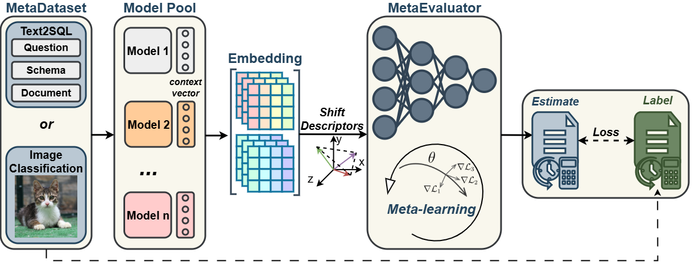

# ActiveEvaluator

> **Budgeted meta-evaluation supervision acquisition.**
>
> Given pools of candidate reference models and labeled support workloads, which
> *model–workload evaluation actions* should we pay to run so that a meta-evaluator
> can assess **future, unseen** models on **unlabeled** targets — under a hard
> labeling budget? ActiveEvaluator selects (i) target-aware sample sets, (ii)
> behavior-aware reference models, and (iii) the model–workload pairs that most
> reduce predictor uncertainty, then meta-trains an accuracy predictor on only the
> acquired entries. Selection maximizes monotone-submodular coverage objectives — an
> **influence-weighted facility-location** term (with `(1-1/e)`-approximation lazy
> greedy), a **submodular-mutual-information** model term, and a **log-determinant**
> pair term — with a non-submodular **direct validation-loss reduction** oracle as an
> empirical upper bound. This is distinct from model selection (the deployed model is
> given), benchmark compression (we generalize to *future* models), and active
> testing (the target stays unlabeled).

## Quick start — reproduce the acquisition benchmark (CPU, no downloads)

```bash
pip install torch numpy
python -m experiments.run_acquisition_benchmark --seeds 5 --budget-frac 0.15
```

This self-contained benchmark builds a controlled meta-evaluation matrix (reference
models × sample-sets with shift descriptors and noisy execution-accuracy labels),
holds out unseen model families, gives every acquisition strategy the same 15%
budget, meta-trains the repo's own `ActiveEvaluator` MLP on the acquired pairs, and
reports unseen-model MAE. It uses the same selection math and predictor as the full
Text2SQL pipeline, so the method ordering mirrors the paper's main table.

<!-- BENCHMARK_RESULTS -->

## Baseline method library

The paper compares against three families; each lives under [baselines/](baselines/)
with a `select`/`estimate` entry point. Implemented methods are in **bold**.

| Family | Methods |
| --- | --- |
| Label-free estimators | **ATC**, **DoC**, AutoEval, AETTA, SSME |
| Budgeted acquisition | **Random**, **k-center**, **Facility-location**, **Matrix completion**, **Active testing**, **Bayesian optimal design**, **Submodular benchmark selection**, **GRAD-MATCH** |
| Reference / ours | **MetaEvaluator (full budget)**, **ActiveEval-S**, **ActiveEval-S+M**, **ActiveEval-Pair** |

The production Text2SQL pipeline (`active_evaluator/active_selection.py`) implements
the same facility-location / GRAD-MATCH / knapsack-budget selection on real
shift descriptors from cached LLM embeddings.



## What's new in this version

The repository has been renamed from `meta_evaluator` to `active_evaluator` and a new active-selection module has been added. The base pipeline (shift descriptors → meta-trained MLP predictor) is unchanged; the new code is a strictly additive layer that runs *between* meta-training and held-out evaluation.

| Concern | Module | Class / function |
| --- | --- | --- |
| Budget arithmetic and per-round split | [active_evaluator/budget.py](active_evaluator/budget.py) | `BudgetPlan`, `compute_budget` |
| Selection algorithms (V1 + V2) | [active_evaluator/active_selection.py](active_evaluator/active_selection.py) | `select_extension`, `lazy_greedy_facility`, `direct_greedy_validation` |
| Pipeline wiring + CLI flags | [active_evaluator/pipeline.py](active_evaluator/pipeline.py) | `extend_test_tasks_with_active_selection` |
| Unit tests for selection | [test/test_active_selection.py](test/test_active_selection.py) | 13 tests |
| Unit tests for budget | [test/test_budget.py](test/test_budget.py) | 8 tests |

The previously-existing modules ([active_evaluator/meta_learning.py](active_evaluator/meta_learning.py), [active_evaluator/model.py](active_evaluator/model.py), [active_evaluator/pipeline.py](active_evaluator/pipeline.py), [shift_descriptor/](shift_descriptor/)) were renamed but kept their behavior. When `--use-active-selection` is *not* passed, the pipeline runs identically to before.

## Repository Layout

- [active_evaluator/](active_evaluator/) — Meta-trained MLP predictor + active-selection module.
  - `active_selection.py` — V1 lazy facility location, V2 direct loss reduction, narrowing, influence weights.
  - `budget.py` — `BudgetPlan` dataclass and `compute_budget` (fraction / absolute / min-budget).
  - `pipeline.py` — End-to-end CLI; the test-time block calls `extend_test_tasks_with_active_selection` when the flag is set.
  - `meta_learning.py`, `model.py` — CAVIA-style meta-learner and 3-layer MLP predictor (unchanged behavior, renamed classes `ActiveEvaluator` / `ActiveEvaluatorLearner`).
- [shift_descriptor/](shift_descriptor/) — Frechet / Mahalanobis / Sliced Wasserstein descriptors from cached embeddings.
- [prompts/](prompts/) — Text2SQL prompt templates.
- [scripts/](scripts/) — Helpers (`inspect_active_evaluator.py`, `rename_model_outputs.py`).
- [test/](test/) — 24 unit tests (`test_active_selection.py`, `test_budget.py`, `test_active_learning.py`).

## Requirements

```bash
pip install torch transformers accelerate bitsandbytes scipy scikit-learn matplotlib tqdm numpy peft
```

`bitsandbytes` and `accelerate` are required for the 4-bit quantized SQL generator. Some checkpoints are gated on Hugging Face — pass `alias=model_id` to `--model-ids` to point at approved variants.

## Active Selection — the new contribution

### Problem statement

At test time, given a held-out *unseen* model with one labeled support pair `(descriptor, accuracy)`, we want the predictor's K-step inner adaptation to be as accurate as possible on a held-out target split. The base pipeline adapts on that single pair. ActiveEvaluator instead:

1. Builds a candidate pool **U** = labeled support pairs from training models, disjoint from the validation set **V**.
2. Narrows **V** to a target-aware subset **V_T** using a Gaussian similarity kernel against the unlabeled target features **T**.
3. Runs `n_rounds` of active selection, each round adding `B / n_rounds` examples to the extension set **S** ⊆ U.
4. Final adaptation runs on **S₀ ∪ S** (where **S₀** is the original support pair).

The invariant **S ∩ V = ∅** is enforced by an `assert` after every round.

### Two selection algorithms

**V1 — Influence-weighted facility location** (`--selection-method v1_facility`, default)

$$\tilde f_1(S) = \sum_{v \in V_T} I(v) \cdot \max_{s \in S \cup S_0} \exp\!\left(-\frac{\|\phi(v) - \phi(s)\|^2}{\tau}\right)$$

where `I(v) = ||∇φ L(h_φ; v)||₂` is the per-example gradient-norm influence weight and `τ` is the median-heuristic bandwidth. Monotone submodular by construction → lazy greedy is provably equivalent to plain greedy and gives a `(1 − 1/e)` approximation under cardinality (Nemhauser, Wolsey & Fisher 1978; Minoux 1978).

**V2 — Direct validation-loss reduction** (`--selection-method v2_direct`)

$$f_2(S) = \mathcal{L}(h_{\phi_K(S_0)}; V_T) - \mathcal{L}(h_{\phi_K(S_0 \cup S)}; V_T)$$

Non-submodular and non-monotone — uses plain greedy with a positive-gain abort rule. Each candidate evaluation requires a full K-step adaptation, so candidates are pre-filtered to the top `--selection-max-candidates-evaluated` by V1's surrogate (FASS-style filtering, Wei, Iyer & Bilmes 2015). This is an empirical upper-bound oracle.

### CLI flags

| Flag | Default | Meaning |
| --- | --- | --- |
| `--use-active-selection` | off | Enable the new test-time branch. |
| `--selection-method` | `v1_facility` | `v1_facility` or `v2_direct`. |
| `--selection-n-rounds` | `5` | Active-learning rounds. |
| `--selection-budget-fraction` | `0.10` | Total budget as a fraction of `|U|`. |
| `--selection-budget-absolute` | `None` | Absolute budget; overrides fraction when set. |
| `--selection-K-steps` | `--eval-inner-steps` | Inner adaptation steps used for V2 oracle. |
| `--selection-narrowing-quantile` | `0.7` | Keep V examples with ρ ≥ this quantile. |
| `--selection-max-candidates-evaluated` | `100` | V2 FASS pre-filter cap. |
| `--selection-seed` | `42` | RNG seed (bandwidth pair sampling, ties). |

### Output artifacts

When `--use-active-selection` is passed, per-test-model diagnostics are written to `outputs/<output-dir>/selection_<sanitized_model_id>/`:

- `budget_plan.json` — total budget, `n_rounds`, per-round split, fraction/absolute used, `cost_fn_name`.
- `narrowing_diagnostics.json` — `|V|`, `|V_T|`, `q`, ρ threshold/mean/min/max.
- `selection_trajectory.json` — per round, the full pick log:
  - `selected_keys` and `selected_source_models` (training-model alias parsed from the candidate key).
  - `picks[]` — one entry per selected candidate. For V1: `marginal_gain`, `cost`, `cumulative_cost_in_round`, `max_sim_to_VT`, `mean_sim_to_VT`, `most_influential_v_index`, `rank_in_round`, `source_model`. For V2: `loss_before`, `loss_after`, `loss_reduction`, `marginal_gain` (per-cost), `n_candidates_evaluated` (FASS pre-filter cap), `cost`, `rank_in_round`, `source_model`.
  - `round_cost_paid`, `round_gain_total`, `influence_stats` (mean/min/max/n of I(v) over V_T).
  - `val_loss_before`, `val_loss_after`, `elapsed_seconds`, `timings` (adapt/embed/influence/greedy seconds).
- `selected_examples.json` — final extension set: list of `{key, source_model, true_label, cost}` records plus the bare `selected_keys` list.
- `selection_summary.json` — top-level recap with: `method`, `tau`, `cost_fn_name`, `budget_total`, `cost_paid_total`, `cost_remaining`, `gain_total`, `n_selected`, `pool_size`, `val_size`, `val_VT_size`, `final_val_loss`, `total_selection_seconds`, `n_rounds_executed`, `source_models_chosen` (the chosen training-model aliases, in pick order), and a human-readable `rationale` paragraph explaining the V1/V2 selection criterion.

These logs answer "**what** got selected" (`source_models_chosen`, `selected[*].source_model`, `selected[*].true_label`), "**why** it got selected" (`picks[*].marginal_gain`, `picks[*].max_sim_to_VT`, `influence_stats`, `rationale`), and "**at what cost**" (`cost_paid_total`, `cost_remaining`, `picks[*].cost`, `picks[*].cumulative_cost_in_round`, `total_selection_seconds`).

### Run example

```bash
python -m active_evaluator.pipeline \
  --train-path data/sft_spider_train_text2sql.json \
  --dev-path data/sft_spider_dev_text2sql.json \
  --output-dir outputs/run_v1 \
  --max-train-samples 1500 --max-dev-samples 300 \
  --use-active-selection \
  --selection-method v1_facility \
  --selection-n-rounds 5 \
  --selection-budget-fraction 0.30 \
  --selection-narrowing-quantile 0.5 \
  --model-ids cycloneboy/SLM-SQL-0.5B Qwen/Qwen2-0.5B ... \
  --test-model-ids Qwen/Qwen2.5-0.5B-Instruct ...
```

### Theoretical guarantees

| Algorithm | Constraint | Guarantee | Reference |
| --- | --- | --- | --- |
| V1 lazy greedy | cardinality (`c(s)=1`) | `(1 − 1/e)` of OPT | Nemhauser, Wolsey & Fisher (1978) |
| V1 cost-benefit greedy | knapsack | `½(1 − 1/e)` of OPT | Khuller, Moss & Naor (1999) |
| V1 with partial enumeration | knapsack | `(1 − 1/e)` of OPT | Sviridenko (2004) |
| V2 plain greedy | cardinality | none (non-submodular) | Wei, Iyer & Bilmes (2015) — empirical oracle |

## Tests

24 unit tests cover correctness invariants (no real-data MAE):

```bash
python -m pytest test/ -v
```

| Group | Coverage |
| --- | --- |
| Budget arithmetic | fraction/absolute/min-floor/cap, JSON round-trip, consistency validation. |
| V1 algorithmic | lazy-greedy ≡ plain-greedy on synthetic 20×5 pool; submodularity (marginal gains non-increasing); disjointness `S ∩ V = ∅`; budget cap; log emission. |
| V2 algorithmic | budget cap; FASS pre-filter cap (verified via `eval_trace` hook); positive-gain abort rule; pipeline-wrapper smoke. |
| Shared machinery | embedding shape; bandwidth scaling; narrowing produces `(1 − q) · |V|`; influence weights non-negative. |

## Base Pipeline (unchanged behavior)

The base pipeline still:

1. Splits a labeled Text2SQL JSON into `meta_train` / `meta_val` / `meta_test`.
2. Runs each Text2SQL LLM in `--model-ids` to generate SQL on each split, computes execution accuracy.
3. Computes shift descriptors (Frechet, Mahalanobis, Sliced Wasserstein) from cached embeddings.
4. Meta-trains a 3-layer MLP predictor mapping `(model_descriptor, distribution_descriptor) → predicted accuracy`.
5. At test time, performs K context-adaptation steps on the held-out model's support descriptor and predicts on `meta_test` and the held-out target split.

```bash
python -m active_evaluator.pipeline \
  --train-path data/sft_spider_train_text2sql.json \
  --dev-path data/sft_spider_dev_text2sql.json \
  --output-dir outputs/run_baseline \
  --max-train-samples 1500 --max-dev-samples 300 \
  --model-ids ... \
  [--test-model-ids ...]
```

## Shift Descriptor Pipeline (auxiliary)

```bash
python -m shift_descriptor.pipeline \
  --train-path data/<train_filename>.json \
  --test-path data/<test_filename>.json \
  --output-dir outputs
```

Extracts pooled embeddings, computes descriptor metrics (Frechet, Mahalanobis, SWD), and reports similarity diagnostics. Outputs include embedding caches, descriptor matrices, PCA plots, and similarity diagnostics.

Key arguments: `--model-ids`, `--lora-r`, `--metric-max-points`, `--prompt-template`, `--context-fields`, `--use-plain-text`, `--text-field`, `--device`. Suffix `:remote` (e.g. `mamba=state-spaces/mamba-2.8b-slimpj:remote`) enables `trust_remote_code` for architectures like Mamba and RWKV.

## Loading Models With This Repo

The pipeline uses Hugging Face causal language models for SQL generation. For Text2SQL LLMs, pass the model IDs via `--model-ids`. Example lightweight models are already in [active_evaluator/pipeline.py](active_evaluator/pipeline.py).

Encoder-decoder Text2SQL models (T5/BART/PICARD/CodeT5p) and structured parsers (RAT-SQL, LGESQL, SmBoP) require custom inference wrappers. Run their generation and execution accuracy separately and plug the accuracy map into the pipeline by extending `run_inference_for_models` or loading a precomputed `model_accuracies.json`.

For image classification backbones, standard PyTorch loaders (e.g. `torchvision.models.resnet50(weights="DEFAULT")` or `timm.create_model("vit_tiny_patch16_224", pretrained=True)`) can be used to produce embeddings and descriptors in a vision-oriented pipeline.

## Mathematical References

- Nemhauser, Wolsey & Fisher (1978). "An analysis of approximations for maximizing submodular set functions." *Math. Programming* 14(1):265–294.
- Khuller, Moss & Naor (1999). "The budgeted maximum coverage problem." *Information Processing Letters* 70(1):39–45.
- Sviridenko (2004). "A note on maximizing a submodular set function subject to a knapsack constraint." *Operations Research Letters* 32(1):41–43.
- Minoux (1978). "Accelerated greedy algorithms for maximizing submodular set functions."
- Mirchandani & Francis (1990). *Discrete Location Theory*.
- Wei, Iyer & Bilmes (ICML 2015). "Submodularity in Data Subset Selection and Active Learning."
- Park, Park & Lee (ICLR 2025). "Active Learning for Continual Learning: Keeping the Past Alive in the Present."

## Legacy benchmarks (pre-active-selection)

The following tables report MAE numbers from the original MetaEvaluator paper (Text2SQL Spider→BIRD and image classification CIFAR→TinyImageNet transfer). They reflect the *base* predictor without active selection and are kept here for reference. New active-selection MAE numbers will be added once the scaled-up benchmark run completes.

### Text2SQL Model Pool (78 Total)

| Category | Count | Families and Models |
| --- | --- | --- |
| Structured Text2SQL Parsers | 8 | RAT-SQL; LGESQL; SmBoP; RESDSQL; Clause-SmBoP; IRNet; BRIDGE; ValueNet / RYANSQL |
| Encoder-Decoder Models | 10 | PICARD T5; FLAN-T5; BART NL2SQL; CodeT5p-770M; FronyAI/natural2sql-ko |
| SQLCoder / SLM-SQL / CscSQL / Hrida | 24 | SQLCoder family; SLM-SQL family; CscSQL-Merge / CscSQL-Grpo; Hrida-T2SQL |
| Other LLMs | 10 | DeepSeek-Coder; Snowflake Arctic-Text2SQL; DeepSeek-R1-Distill; WizardCoder; Mistral; Llama-3.1; Qwen2.5 |
| Modern General LLM Backbones | 26 | DeepSeek-V3; OLMo-2; gemma-3; Mistral-Small-3.1; Llama-4; Qwen3; SmolLM3; Kimi-K2; GPT-OSS; GLM-4.5/4.6; MiniMax; RWKV; Mamba2 |

### Image Classification Model Pool (43 Total)

| Category | Count | Families |
| --- | --- | --- |
| Classic CNN | 2 | LeNet-5; AlexNet |
| VGG / Residual / Wide / Dense | 17 | VGG-11..19; ResNet-18..152; WideResNet; DenseNet |
| Efficient Mobile CNNs | 10 | MobileNet-V1..V3; ShuffleNet-V2; EfficientNet-B0..B2 |
| Scaled / Lightweight CNNs | 5 | SqueezeNet; RegNet |
| CIFAR-Standard Robust Baselines | 9 | ResNet-20/56/110; PreAct-ResNet; PyramidNet; Shake-Shake; ResNeXt-29; DenseNet-BC; MobileNetV2 |

Full per-model MAE tables (DoC / ATC / AGD / PseudoAutoEval / AutoEval / NL2SQL-BUGS / SelfTrainEns vs. ActiveEvaluator base) are preserved in the git history of this README prior to commit `<active-selection-rewrite>`.
